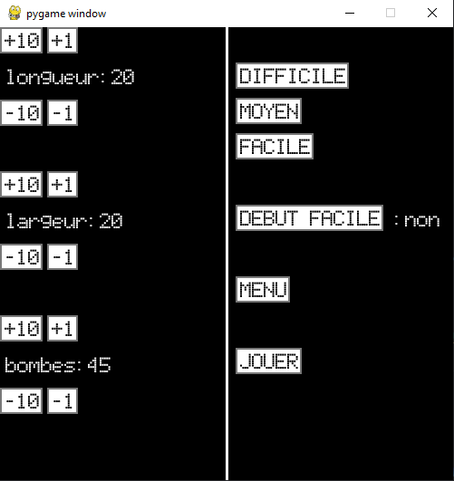
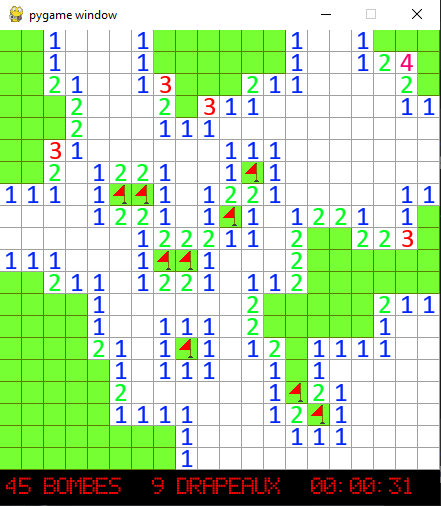
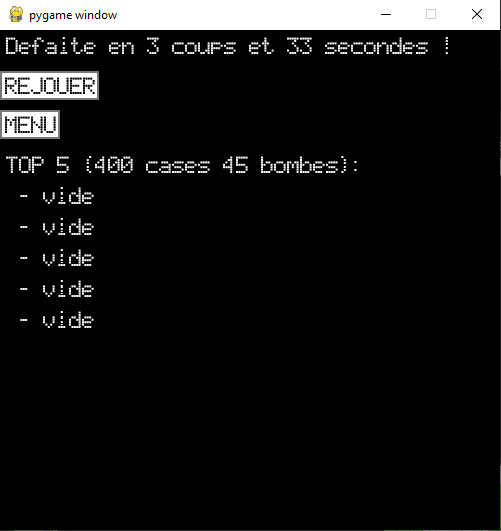
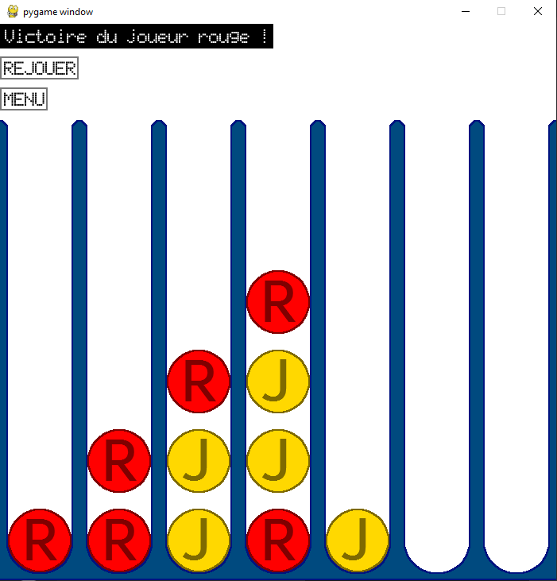

# Mini-jeux: Demineur et connect 4

>Auteur: Raphaël Roumat

Projet personnel de mini-jeux en python.

Bibliothèques utilisés:

- `pygame`: primitives des fenêtres et fonctionnalités graphiques de base pour jeux vidéos
- `sqlite3`: gestion de bases de données sqlite3

## Description:

Démineur classique avec interface graphique, chronomètre et gestion des sauvegardes des parties précédentes victorieuses avec classement.
Le connect 4 est classique et sans changement.

## Démineur

|   menu des paramètres   |  jeu   |   écran de fin   |
 | :----: | :----: | :----: |
|  |  |  |
## Connect 4

